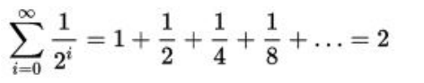

The program calculates the following convergent series:

The convergent series was chosen for easy tracking of the calculation results.

Added support for multithreaded calculation using java.concurrency.

Input parameter: integer H, must be entered from the console.
The function will be calculated for each integer from 0 to N.

By default, the maximum number of threads is 10.

The calculation process is accompanied by logging, which outputs the intermediate results of the streams to the console.

___
Example of calculation output:

    Enter positive integer:
    12
    The function will be evaluated for numbers from 0 to 12
    16:34:20.794 [pool-2-thread-2] INFO  ru.cft.shift.Task - thread result = 0.375000
    16:34:20.794 [pool-2-thread-4] INFO  ru.cft.shift.Task - thread result = 0.023438
    16:34:20.794 [pool-2-thread-1] INFO  ru.cft.shift.Task - thread result = 1.500000
    16:34:20.794 [pool-2-thread-7] INFO  ru.cft.shift.Task - thread result = 0.000244
    16:34:20.794 [pool-2-thread-5] INFO  ru.cft.shift.Task - thread result = 0.005859
    16:34:20.794 [pool-2-thread-3] INFO  ru.cft.shift.Task - thread result = 0.093750
    16:34:20.794 [pool-2-thread-6] INFO  ru.cft.shift.Task - thread result = 0.001465
    Result of evaluation: 1.999755859375